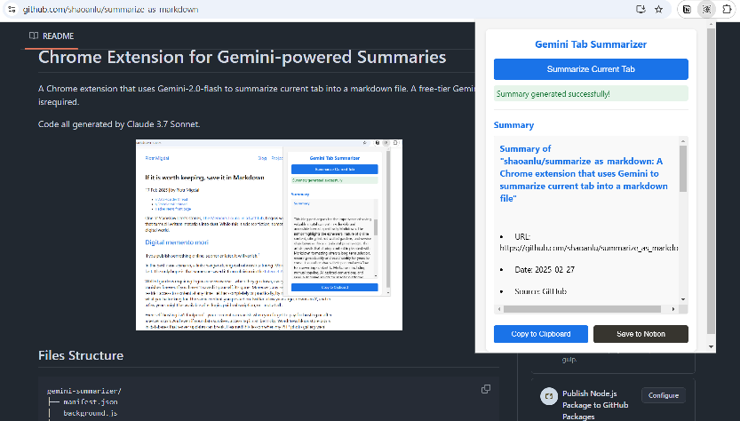

# Chrome Extension for Gemini-powered Summaries
A Chrome extension that uses Gemini-2.0-flash to summarize current tab into a markdown file and save it to Notion. A free-tier Gemini API key is required.

Code all generated by Claude 3.7 Sonnet.

<p align="center">
  
</p>

## Load the extension in Chrome:

1. Open Chrome and go to chrome://extensions/
2. Enable "Developer mode" (toggle in top-right)
3. Click "Load unpacked" and select `gemini-summarizer` directory

## Changing Gemini model
Modify endpoint in `background.js` from `gemini-2.0-flash` to a [available model name](https://ai.google.dev/gemini-api/docs/models/gemini). (endpoint reference [here](https://ai.google.dev/api/generate-content))

## Integration with Notion
1. Create a [internal integration secrets](https://www.notion.so/profile/integrations) in Notion
2. Create a new [table database](https://www.notion.com/help/guides/creating-a-database) in Notion. Add a `text` field named "Title", an `URL` field named "URL", and a `multi-select` field named "Tags" to it. (otherwise there will be errors when adding adding summaries to Notion)
3. Give [database permission](https://developers.notion.com/docs/create-a-notion-integration#give-your-integration-page-permissions) to the integration created in step 1.
4. In the chrome extension, set API key (the integration secret) and database ID (`https://www.notion.so/{workspace_name}/{database_id}?v={view_id}` of the page link, [ref.](https://developers.notion.com/docs/working-with-databases#adding-pages-to-a-database)).

<p align="center">
  
</p>

## Files Structure
```
gemini-summarizer/
├── manifest.json
├── background.js
├── popup.html
├── popup.js
├── content.js
├── styles.css
└── images/
    └── icon*.png
```

## Acknowledgement
- Motivated by recent article [If it is worth keeping, save it in Markdown](https://p.migdal.pl/blog/2025/02/markdown-saves) by Piotr Migdał.
- Inspired by Alchain花生's YouTube video using Cursor to create a Chrome extension [The World's Most Powerful AI Coding Tool—Cursor: Everyone Can Be a Programmer](https://youtu.be/R9JIi2zMNHA?feature=shared).
- Icons are from [FREEPIK](https://www.freepik.com/icon/ai-technology_18951459#fromView=search&page=1&position=51&uuid=dcdae7b1-eda1-480e-ac3e-f26de30b7119)