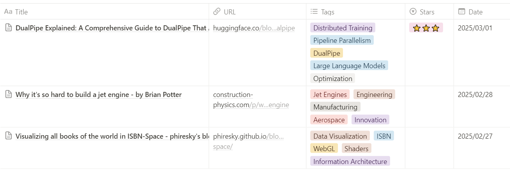

# Gemini Tab Summarizer - Chrome Extension

This Chrome extension uses Google's Gemini API to summarize the content of the current webpage and optionally save it to a Notion database.  It generates a Markdown-formatted summary, including the page title, URL, date, source, and suggested tags.

**NOTE:** Data from free-tier Gemini API users are stored and used to train the model.

**Key Features:**

*   LLM-Powered Summarization in Chrome
*   Markdown Output
*   Notion Integration
*   LLM-Generated weekly recap from past week's saved summaries on Notion


**Code all generated by Claude 3.7 Sonnet.**

<p align="center">
  
</p>

## Installation

1.  **Clone or Download The Repository:** Clone this repository or download the ZIP file and extract it.

2.  **Load Unpacked Extension:**
    *   Open Chrome and navigate to `chrome://extensions/`.
    *   Enable "Developer mode" (toggle switch in the top-right corner).
    *   Click "Load unpacked".
    *   Select the `gemini-summarizer` directory.

## Usage

1.  **Set Gemini API Key:**
    *   Click the extension icon in the Chrome toolbar.
    *   Enter your Gemini API key (obtained from [Google AI Studio](https://ai.google.dev/)) and click "Save". (The API key is saved in your browser's local storage.)

2.  **Summarize a Page:**
    *   Navigate to the webpage you want to summarize.
    *   Click the extension icon and click "Summarize Current Tab".
    *   The summary will appear in a popup.  It will also be automatically copied to your clipboard.


## Notion Integration (Optional)

To save summaries directly to Notion, you'll need to set up an integration and provide your API key and database ID (that are saved in your browser's local storage).

1. Create an [internal integration secrets](https://www.notion.so/profile/integrations) in Notion to get the secret key
2. Setup a new [table database](https://www.notion.com/help/guides/creating-a-database) in Notion with these required properties (columns):
    * `Title` (Plain Text)
    * `URL` (URL)
    * `Tags` (Multi-select)
    * `Date` (Date)
3. Connect the integration to the database by giving [database permission](https://developers.notion.com/docs/create-a-notion-integration#give-your-integration-page-permissions) to the integration created in step 1.
4. Configure the extension with the API key (the integration secret) and database ID (found in the database URL:`https://www.notion.so/{workspace_name}/{database_id}?v={view_id}` - [reference](https://developers.notion.com/docs/working-with-databases#adding-pages-to-a-database)).

<p align="center">
  
</p>

## Changing the Gemini Model

The extension defaults to the `gemini-2.0-flash` model.  To use a different model:

1.  Open `background.js` and `weeklyRecap.js`.
2.  Find the line:
    ```javascript
    const response = await fetch(`https://generativelanguage.googleapis.com/v1beta/models/gemini-2.0-flash:generateContent?key=${apiKey}`, {
    ```
3.  Change `gemini-2.0-flash` or `gemini-2.0-pro-exp-02-05` to the desired [model name](https://ai.google.dev/gemini-api/docs/models/gemini). Ensure the model you select supports the `generateContent` method.


## Files Structure
```
gemini-summarizer/
├── manifest.json
├── background.js
├── notionUtils.js
├── popup.html
├── popup.js
├── content.js
├── styles.css
└── images/
    └── icon*.png (128x128)
```

## Troubleshooting

*   **"No summary generated"**: This could mean the Gemini API key is invalid, the API is unavailable, or no content was found on the page.
*   **"Error saving to Notion"**: Check your Notion API key, database ID, and that the database has the required properties (`Title`, `URL`, `Tags`, `Date`).
*   **Notion setup button doesn't work**: Make sure that the fields are not empty.

## Acknowledgements

*   Inspired by [If it is worth keeping, save it in Markdown](https://p.migdal.pl/blog/2025/02/markdown-saves) by Piotr Migdał.
*   Motivated by Alchain花生's YouTube video [The World's Most Powerful AI Coding Tool—Cursor: Everyone Can Be a Programmer](https://youtu.be/R9JIi2zMNHA?feature=shared).
*   Icons are from [FREEPIK](https://www.freepik.com/icon/ai-technology_18951459#fromView=search&page=1&position=51&uuid=dcdae7b1-eda1-480e-ac3e-f26de30b7119).
